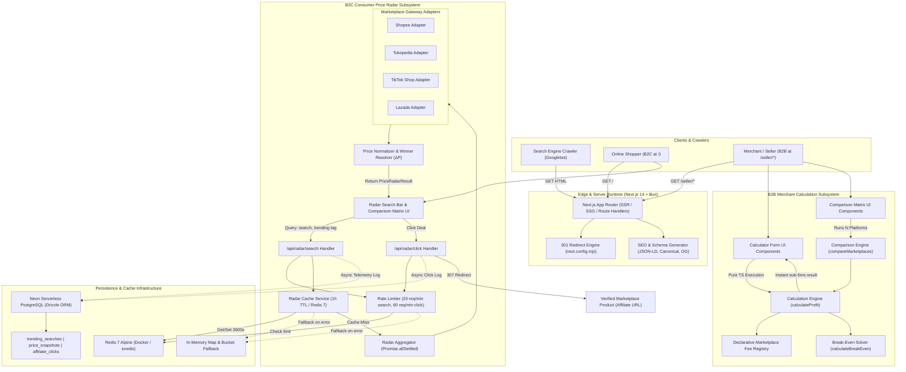

# System Architecture & Technical Design Document
## Project: Indonesian Marketplace Intelligence & Profit Calculator Platform

- **Document Version:** 2.0.0
- **Status:** Approved for Dual-Portal & Price Radar Production
- **Lead Architect:** Lead Software Architect & Senior Full-Stack Engineer

---

## 1. Architectural Philosophy & Principles

The architectural design of **Marketplace Intelligence Indonesia** is guided by five foundational principles:

1. **Dual-Portal Persona Separation:**
   Consumer shopping discovery (`/`) and merchant unit-economics (`/seller/*`) are strictly decoupled. Shoppers experience a zero-clutter price radar with no merchant accounting jargon, while sellers receive comprehensive financial tools and fee documentation.
2. **Separation of Domain Logic from UI:**
   Calculation and radar aggregation logic are 100% pure TypeScript, decoupled from React components, hooks, or DOM APIs. Both the B2B calculation engine and B2C normalizer operate independently of rendering targets.
3. **Resilient Layered Infrastructure (Fail-Safe Architecture):**
   External network resources (Redis 7 Docker, Neon Serverless Postgres, and third-party marketplace gateways) are guarded by automatic, in-memory and mock fallbacks. The platform operates 100% independently in local development, CI testing, and Edge runtimes without hard external failures.
4. **Sub-15ms Caching & Zero-Latency Calculations:**
   Price radar searches utilize a 1-hour Redis cache TTL (`radar:query:<slug>`) yielding sub-15ms response times on hits. When uncached, concurrent gateway fetch executes via `Promise.allSettled`. B2B profit calculations run 100% client-side with zero server roundtrips.
5. **SEO & Backward Compatibility as First-Class Citizens:**
   All 36 canonical routes are server-rendered (SSR/SSG) for search bots with rich JSON-LD schemas. Legacy URLs are permanently preserved via HTTP 301 redirects (`next.config.mjs`), ensuring zero loss of domain ranking or backlinks.

---

## 2. High-Level Architecture Diagram



---

## 3. Technology Stack Selection & Justification

| Layer | Selection | Architectural Justification |
| :--- | :--- | :--- |
| **Runtime & Package Manager** | **Bun v1.3.14+** | High-performance JavaScript/TypeScript runtime with instantaneous package installations, sub-millisecond script startup, and blazing-fast test execution. |
| **Framework** | **Next.js 14+ (App Router)** | Best-in-class SSG/SSR support for SEO, built-in metadata API, route handlers, native sitemap generation, zero-config code splitting, and high performance on Edge/Node runtimes. |
| **Language** | **TypeScript 5.x (Strict Mode)** | Complete type safety across domain interfaces, configuration objects, radar adapters, and UI components. Eliminates null/undefined runtime crashes. |
| **Styling & Tokens** | **Tailwind CSS 3.x** | Utility-first, zero-runtime CSS overhead, highly responsive mobile-first layouts, and custom tokens for the modern fintech palette (`#FAFAF9` canvas, Slate-900 text, Emerald profit, Rose loss). |
| **Icons & Brand Identity** | **Google Material Symbols & SVG Logos** | 100% Zero-Emoji standard. Unified brand SVG components (`MarketplaceIcon.tsx`) and accessible, lightweight Material Symbols replacing raw emojis across all portals. |
| **UI Primitives** | **shadcn/ui (Radix UI Core)** | Unstyled, accessible (WAI-ARIA compliant) headless primitives for Select, Tabs, Tooltip, Accordion, and Dialog without heavy bundle locks. |
| **Animation Engine** | **Framer Motion (`framer-motion`)** | Declarative springs for numerical profit tickers, smooth accordion drawer expansion, and layout-preserving marketplace selector tabs with zero CLS impact. (See [ADR-008](file:///home/andim/ideas/marketplace-intelegence/docs/decisions/ADR-008-client-animation-strategy-motion-and-cls-safety.md)). |
| **Typography (Font Trio)** | **Display + Body + Tabular Mono** | 1. Display/Heading: *Plus Jakarta Sans* / *Geist Sans*.<br>2. Body: *Inter* / *Plus Jakarta Sans*.<br>3. Tabular Numeric: *Geist Mono* / *JetBrains Mono* with `tabular-nums` for exact column alignment. (See [ADR-007](file:///home/andim/ideas/marketplace-intelegence/docs/decisions/ADR-007-design-system-fintech-utility-and-typography-trio.md)). |
| **Caching Layer** | **Redis 7 Alpine (Docker / `ioredis`)** | Atomic string key storage with 3600s TTL for aggregated search queries. Resilient automated in-memory LRU fallback when Redis is offline. (See [ADR-010](file:///home/andim/ideas/marketplace-intelegence/docs/decisions/ADR-010-b2c-price-radar-engine-caching-and-rate-limiting.md)). |
| **Security & Rate Limiting** | **Sliding Window Rate Limiter** | Redis atomic `INCR` + `EXPIRE` window (20 req/min for search, 60 req/min for clicks) returning RFC 6585 standard headers (`X-RateLimit-*`) and HTTP 429 status on abuse. |
| **Database & ORM** | **Neon Postgres & Drizzle ORM** | Serverless PostgreSQL connected via Drizzle ORM for logging trending search analytics, historical price snapshots, and affiliate click tracking. |
| **Validation** | **Zod** | Declarative schema validation for user input parsing and runtime configuration sanity checks. |
| **Testing** | **Vitest** | Sub-millisecond execution for unit test suites covering the pure domain calculation engine, break-even solver, radar normalizer, and rate limiter. |

---

## 4. Visual Design Architecture: The "Modern Financial Utility"

The product strictly avoids the **"Seller Admin Dashboard"** anti-pattern (crammed sidebars, dark crypto themes, 40 random cards). It deploys a dual-portal utility design where consumers easily compare live marketplace prices, and sellers calculate unit-economics without interference.

### 4.1 Four Architectural Reference Pillars
1. **Wise (Structure & Intent Flow):**
   - Clean top navigation with active persona indicator.
   - High-intent hero section and focused input container.
   - Prominent result signature card with clear savings / profit metrics.
   - Authoritative explanatory SEO content and FAQs below.
2. **SlickCalc (Calculator Ergonomics & Minimalism):**
   - Whitespace-driven, distraction-free experience.
   - Large input touchpoints with clear Indonesian Rupiah prefixes.
   - Zero gratuitous charts or decorative noise.
3. **Marketplace Analytics (Data Hierarchy & Comparison):**
   - Side-by-side comparative metric cards across Shopee, Tokopedia, TikTok Shop, and Lazada.
   - Clear visual flags for `"Paling Murah"` (B2C) and `"Margin Terbaik"` (B2B).
4. **Modern Fintech UI (Typography, Spacing & Trust):**
   - Off-white canvas (`#FAFAF9`), pure white card surfaces (`#FFFFFF`), very light gray borders (`#E2E8F0`).
   - Subtle marketplace branding badges (`MarketplaceIcon.tsx`), never full-page color washes.

### 4.2 Dual-Portal Layout Topologies

#### A. Consumer Price Radar Portal (`/`)
- **Header:** Persona toggle tabs (`Pembeli` [Underlined Active] | `Penjual`).
- **Hero & Search Bar:** High-intent search input with explicit action button labeled `Search` and trending query chips.
- **4-Way Comparison Matrix:** Side-by-side product deal cards across Shopee, Tokopedia, TikTok Shop, and Lazada.
- **Value Highlight:** Platform offering the absolute lowest price receives a distinct `"Paling Murah"` badge with price delta savings callout ($\Delta P$).
- **Zero Merchant Jargon:** HPP, profit margins, and operational costs are completely hidden from the consumer experience.

#### B. Merchant Hub & Calculators (`/seller/*`)
- **Header:** Persona toggle tabs (`Pembeli` | `Penjual` [Underlined Active]) + Sub-navigation (`Kalkulator`, `Bandingkan`, `Biaya Admin`).
- **Calculator Card:** Selling price, HPP, ad budget, affiliate, and tier inputs.
- **Profit Signature Card:** Ticker display with net profit (IDR), net margin (%), and break-even selling price.
- **Desktop 3-Column Safe Ad Layout:**
```text
┌───────────────────────────────────────────────────────────────┐
│ [Logo] Marketplace Intelligence     Pembeli  <u>Penjual</u>    │
│ Sub-nav: Kalkulator | Komparasi Fee | Biaya Admin             │
├───────────────────────────────────────────────────────────────┤
│                                                               │
│                         HERO SECTION                          │
│                Big Headline & Direct Tool Value               │
│                                                               │
│     ┌──────────────────────────────────────────────────┐      │
│     │            MAIN CALCULATOR CARD                  │      │
│     │  [Marketplace Selector Tabs]                     │      │
│     │  Selling Price | HPP | Ads | Affiliate | Tier    │      │
│     │                 [ HITUNG SEKARANG ]              │      │
│     └──────────────────────────────────────────────────┘      │
│                                                               │
├───────────────┬───────────────────────────────┬───────────────┤
│   AD SLOT     │      YOUR PROFIT SIGNATURE    │    AD SLOT    │
│ (sidebar-left)│           Rp 17.600           │(sidebar-right)│
│               │            +17.6%             │               │
│               │  ┌─────────────────────────┐  │               │
│               │  │ Quick 4-Platform Preview│  │               │
│               │  └─────────────────────────┘  │               │
│               │      Itemized Fee Drawer      │               │
├───────────────┴───────────────────────────────┴───────────────┤
│             4-WAY CROSS-MARKETPLACE COMPARISON MATRIX         │
├───────────────────────────────────────────────────────────────┤
│        EDITORIAL EXPLANATORY CONTENT & SEO FORMULAS           │
└───────────────────────────────────────────────────────────────┘
```

### 4.3 100% Zero-Emoji UI Standard
To maintain institutional fintech trust, raw Unicode emojis are strictly forbidden across the codebase. All visual signifiers utilize:
- **Marketplace Logos:** Unified SVG brand icons in `src/components/ui/MarketplaceIcon.tsx`.
- **Interface Glyphs:** Google Material Symbols (`search`, `trending_up`, `verified`, `store`, `star`, `arrow_forward`, `open_in_new`).

---

## 5. Codebase Organization & Folder Structure

```
marketplace-intelegence/
├── docker-compose.yml                    # Redis 7 Alpine Container Configuration
├── docs/                                 # Architectural & Product Documentation
│   ├── BRD.md                            # Business Requirements Document (Dual-Persona)
│   ├── PRD.md                            # Product Requirements Document (36 Canonical Routes)
│   ├── ARCHITECTURE.md                   # System Architecture (This file)
│   ├── decisions/                        # Architecture Decision Records (ADRs)
│   │   ├── ADR-001-modular-monolith-nextjs-tech-stack.md
│   │   ├── ADR-002-domain-driven-calculation-engine.md
│   │   ├── ADR-003-declarative-marketplace-fee-rule-schema.md
│   │   ├── ADR-004-monetary-precision-and-idr-currency-handling.md
│   │   ├── ADR-005-seo-first-content-and-rendering-architecture.md
│   │   ├── ADR-006-monetization-extensibility-ads-and-affiliate.md
│   │   ├── ADR-007-design-system-fintech-utility-and-typography-trio.md
│   │   ├── ADR-008-client-animation-strategy-motion-and-cls-safety.md
│   │   ├── ADR-009-dual-portal-architecture-and-persona-separation.md
│   │   └── ADR-010-b2c-price-radar-engine-caching-and-rate-limiting.md
│   └── mockups/                          # Wireframe & Architecture Visual Assets
├── src/
│   ├── app/                              # Next.js App Router (36 Canonical Routes)
│   │   ├── layout.tsx                    # Root Layout (Nav, Footer, Global Fonts)
│   │   ├── page.tsx                      # [B2C] Consumer Price Radar Portal
│   │   ├── seller/                       # [B2B] Seller Intelligence Portal
│   │   │   ├── page.tsx                  # Seller Portal Hub & Main Calculator
│   │   │   ├── kalkulator/               # Dedicated Marketplace Calculators
│   │   │   │   ├── marketplace-calculator/page.tsx
│   │   │   │   ├── shopee/page.tsx
│   │   │   │   ├── tokopedia/page.tsx
│   │   │   │   ├── tiktok-shop/page.tsx
│   │   │   │   └── lazada/page.tsx
│   │   │   ├── biaya-admin/              # Fee Schedules & Category Guides
│   │   │   │   ├── shopee/page.tsx
│   │   │   │   ├── tokopedia/page.tsx
│   │   │   │   ├── tiktok-shop/page.tsx
│   │   │   │   └── lazada/page.tsx
│   │   │   └── komparasi-fee/            # Comparative Matrix & Head-to-Head
│   │   │       ├── page.tsx
│   │   │       ├── shopee-vs-tokopedia/page.tsx
│   │   │       ├── shopee-vs-tiktok-shop/page.tsx
│   │   │       └── tokopedia-vs-tiktok-shop/page.tsx
│   │   ├── api/radar/                    # B2C Price Radar Route Handlers
│   │   │   ├── search/route.ts           # Cached search aggregation endpoint
│   │   │   ├── click/route.ts            # Affiliate outbound tracking & redirect
│   │   │   └── trending/route.ts         # Trending query telemetry endpoint
│   │   ├── sitemap.ts                    # Dynamic XML Sitemap Generator
│   │   ├── robots.ts                     # Search Engine Robots Directive
│   │   ├── not-found.tsx                 # Custom 404 Error Page
│   │   └── error.tsx                     # Global Error Boundary
│   ├── components/                       # UI Component Library
│   │   ├── layout/                       # Header (Active Underline), Footer, Breadcrumbs
│   │   ├── radar/                        # RadarSearchBar, RadarResultsMatrix, RadarDealCard
│   │   ├── calculator/                   # Calculator Form, Result Card, Fee Accordion
│   │   ├── comparison/                   # Side-by-Side Comparison Matrix Table
│   │   ├── ads/                          # AdSlot Container Component
│   │   ├── affiliate/                    # AffiliateLink Routing Component
│   │   ├── seo/                          # Structured Data (JSON-LD), FAQ Accordion
│   │   └── ui/                           # MarketplaceIcon, Badges, Inputs, Tabs
│   ├── domain/                           # Pure Domain Calculation & Aggregation Layer
│   │   ├── calculator/                   # Calculation Engine, Break-Even, Types
│   │   │   ├── engine.ts                 # Core calculateProfit function
│   │   │   ├── comparison.ts             # compareMarketplaces aggregator
│   │   │   ├── breakeven.ts              # Iterative break-even price solver
│   │   │   └── types.ts                  # Domain TypeScript interfaces
│   │   ├── radar/                        # B2C Price Radar Domain
│   │   │   ├── types.ts                  # MarketplaceProductOffer, PriceRadarResult
│   │   │   ├── normalizer.ts             # Price delta calculation & winner flag
│   │   │   ├── radarAggregator.ts        # Concurrent multi-gateway aggregator
│   │   │   ├── cache.ts                  # Redis 1h TTL service with memory fallback
│   │   │   └── adapters/                 # Gateway Adapters (Shopee, Tokopedia, TikTok, Lazada)
│   │   └── marketplace/                  # Marketplace Entity Definitions & Types
│   ├── data/marketplaces/                # Declarative Marketplace Fee Configurations
│   │   ├── registry.ts                   # Registry & Accessor API
│   │   ├── shopee.ts                     # Shopee Tier/Category/Program Fee Config
│   │   ├── tokopedia.ts                  # Tokopedia Tier/Category/Program Fee Config
│   │   ├── tiktok-shop.ts                # TikTok Shop Tier/Category/Program Fee Config
│   │   └── lazada.ts                     # Lazada Tier/Category/Program Fee Config
│   ├── db/                               # Database Persistence Layer
│   │   ├── schema.ts                     # Drizzle ORM Schemas (trending, snapshots, clicks)
│   │   └── index.ts                      # Neon Serverless Postgres Client Connection
│   ├── lib/                              # Shared Utilities & Infrastructure
│   │   ├── security/rateLimiter.ts       # Sliding Window Rate Limiter (Redis + In-Memory)
│   │   ├── formatting/                   # Indonesian Rupiah & Percentage Formatters
│   │   ├── seo/                          # Metadata Builders & Schema Generators
│   │   ├── validation/                   # Zod Schemas for Inputs & Configs
│   │   └── analytics/                    # Abstract Analytics Dispatcher
│   └── config/                           # Application & Feature Flag Configuration
│       ├── site.ts                       # Site Metadata & Route Configurations
│       ├── ads.ts                        # Ad Slot Placement Definitions & Switches
│       └── affiliate.ts                  # Affiliate Link Destination Providers
├── tests/                                # Vitest Unit & Integration Test Suites
│   ├── unit/
│   │   ├── engine.test.ts                # Calculation engine behavioral tests
│   │   ├── breakeven.test.ts             # Break-even solver tests
│   │   ├── comparison.test.ts            # Multi-marketplace comparison tests
│   │   ├── formatting.test.ts            # Currency precision & parsing tests
│   │   ├── radar.test.ts                 # Radar normalizer & aggregation tests
│   │   └── rateLimiter.test.ts           # Sliding window rate limiter tests
│   └── seo/
│       └── metadata.test.ts              # Route metadata & schema completeness
├── next.config.mjs                       # Next.js Config & 301 Permanent Redirects
├── package.json                          # Bun Package Dependencies & Scripts
├── tsconfig.json                         # Strict TypeScript Configuration
└── tailwind.config.ts                    # Modern Fintech Tailwind Theme
```

---

## 6. Domain Model & Calculation Engine Architecture

### 6.1 Data Contracts (Domain Interfaces)

```typescript
// src/domain/calculator/types.ts

export type MarketplaceId = 'shopee' | 'tokopedia' | 'tiktok-shop' | 'lazada';

export interface CalculatorInput {
  marketplaceId: MarketplaceId;
  sellerTierId: string;
  categoryId: string;
  sellingPrice: number;        // in IDR (integer Rupiah)
  productCost: number;         // HPP in IDR
  advertisingCost?: number;    // per unit in IDR
  affiliatePercentage?: number;// e.g. 5 for 5%
  voucherCost?: number;        // per unit in IDR
  shippingSubsidy?: number;    // per unit in IDR
  selectedPrograms?: string[]; // IDs of selected extra programs (e.g. 'gratis_ongkir_xtra')
}

export interface FeeItem {
  id: string;
  name: string;
  category: 'admin' | 'service' | 'payment' | 'program' | 'affiliate' | 'tax';
  rate: number;                // Decimal rate (e.g. 0.04 for 4%)
  fixedAmount: number;         // Fixed Rupiah deduction
  calculatedAmount: number;    // Resulting fee in IDR
  minAmount?: number;          // Floor cap
  maxAmount?: number;          // Ceiling cap
  description?: string;
  isOptional: boolean;
}

export interface CalculationResult {
  input: CalculatorInput;
  sellingPrice: number;
  productCost: number;
  totalMarketplaceFees: number;
  paymentFee: number;
  affiliateFee: number;
  operationalCosts: {
    advertisingCost: number;
    voucherCost: number;
    shippingSubsidy: number;
    total: number;
  };
  feeBreakdown: FeeItem[];
  totalDeductions: number;     // Total marketplace fees + operational costs
  totalCost: number;           // Total deductions + productCost
  netProfit: number;           // sellingPrice - totalCost
  netMargin: number;           // (netProfit / sellingPrice) * 100
  breakEvenPrice: number;      // Minimum selling price where netProfit = 0
  effectiveFeeRate: number;    // (totalMarketplaceFees / sellingPrice) * 100
  isProfitable: boolean;
}

export interface MarketplaceComparisonItem {
  marketplaceId: MarketplaceId;
  marketplaceName: string;
  sellerTierName: string;
  result: CalculationResult;
  isBestMargin: boolean;
  profitDifferenceFromBest: number;
}

export interface ComparisonResult {
  baseInput: CalculatorInput;
  items: MarketplaceComparisonItem[];
  bestMarketplaceId: MarketplaceId;
}
```

### 5.2 Declarative Fee Rule Configuration Schema

```typescript
// src/domain/marketplace/types.ts

export type FeeCalculationType = 'percentage' | 'fixed' | 'tiered' | 'hybrid';

export interface FeeRule {
  id: string;
  name: string;
  type: FeeCalculationType;
  category: 'admin' | 'service' | 'payment' | 'program' | 'tax';
  percentageRate: number;      // e.g. 0.0425 for 4.25%
  fixedFee: number;            // in IDR
  minFee?: number;             // Minimum fee in IDR
  maxFee?: number;             // Maximum fee cap in IDR
  applicableTiers?: string[];  // e.g. ['star_seller', 'star_plus'] or undefined for all
  applicableCategories?: Record<string, number>; // Specific rate override by category ID
  conditionDescription?: string;
  isDefaultActive: boolean;
  isOptional: boolean;
}

export interface SellerTier {
  id: string;
  name: string;
  description: string;
  isDefault?: boolean;
}

export interface ProductCategoryGroup {
  id: string;
  name: string;
  description: string;
  defaultAdminFeeRate: number;
}

export interface MarketplaceConfig {
  id: MarketplaceId;
  name: string;
  slug: string;
  brandColor: string;
  version: string;
  lastVerifiedDate: string;
  sourceUrl: string;
  disclaimer: string;
  sellerTiers: SellerTier[];
  categories: ProductCategoryGroup[];
  rules: FeeRule[];
}
```

### 5.3 Deterministic Engine Pipeline

The calculation algorithm follows an immutable, functional pipeline:

```
[CalculatorInput]
       │
       ▼
1. Normalize & Clamp Inputs (Default zero for undefined optional values)
       │
       ▼
2. Resolve Marketplace Config (Tiers, Categories, Applicable Rules)
       │
       ▼
3. Evaluate Base Admin Fee (Resolve Category Rate Override or Tier Rate)
       │
       ▼
4. Evaluate Service & Extra Program Fees (Gratis Ongkir Xtra, Cashback Xtra, with Max Caps)
       │
       ▼
5. Evaluate Payment Processing Fee (e.g. 1% with Min/Max bounds)
       │
       ▼
6. Evaluate Affiliate Commission (sellingPrice * affiliatePercentage / 100)
       │
       ▼
7. Aggregate Operational Deductions (Ads + Voucher + Shipping)
       │
       ▼
8. Compute Gross Deductions, Total Costs, Net Profit, and Net Margin
       │
       ▼
9. Solve Exact Break-Even Selling Price via Closed-Form or Bounded Binary Iteration
       │
       ▼
10. Format Monetary Values (Rounded integer IDR, no fractional sub-units)
       │
       ▼
[CalculationResult]
```

---

## 7. Currency & Number Precision Strategy

### 7.1 The Floating-Point Hazard
In JavaScript, floating-point arithmetic produces notorious precision errors (e.g. `100000 * 0.0425 = 4250.000000000001` or `0.1 + 0.2 = 0.30000000000000004`). In a financial calculator, displaying `Rp4.250,000000000001` destroys credibility.

### 7.2 IDR Integer Arithmetic Strategy
- **Indonesian Rupiah has no circulating decimal coins (Sen).** All actual transactions in Indonesian retail are rounded to whole Rupiah.
- **Rule:**
  - Intermediate calculations use standard JavaScript numbers with explicit rounding via `Math.round()` at each distinct fee step.
  - Commission rates are stored as exact decimal numbers (e.g. `0.0425` for 4.25%).
  - The final outputs (`calculatedAmount`, `netProfit`, `totalCost`, `breakEvenPrice`) are strictly rounded integers:
    $$\text{fee} = \text{Math.round}(\text{sellingPrice} \times \text{rate})$$
  - Number formatters use `Intl.NumberFormat('id-ID', { style: 'currency', currency: 'IDR', minimumFractionDigits: 0, maximumFractionDigits: 0 })`, rendering clean `Rp100.000` with standard Indonesian thousand separators (`.`).

---

## 8. B2C Consumer Price Radar Subsystem Architecture

The B2C Price Radar provides real-time, multi-platform product discovery and deal intelligence at the root route (`/`).

### 8.1 Gateway Adapter Pattern
To isolate platform-specific data quirks, the subsystem employs an Adapter Pattern implementing a uniform contract:

```typescript
// src/domain/radar/types.ts
export interface MarketplaceAdapter {
  marketplaceId: MarketplaceId;
  marketplaceName: string;
  search(keyword: string): Promise<MarketplaceProductOffer[]>;
}
```

The adapters reside in `src/domain/radar/adapters/`:
- `shopeeAdapter.ts`: Resolves Shopee Star and Mall offers with volume sold indicators.
- `tokopediaAdapter.ts`: Resolves Tokopedia Official Store and Power Merchant offers.
- `tiktokShopAdapter.ts`: Resolves TikTok Shop verified creator and merchant offers.
- `lazadaAdapter.ts`: Resolves LazMall and Top Seller product listings.

### 8.2 Concurrent Aggregation Pipeline (`radarAggregator.ts`)
Queries are executed across all 4 marketplace adapters concurrently using `Promise.allSettled`:
```typescript
export async function searchAllMarketplaces(query: string): Promise<MarketplaceProductOffer[]> {
  const promises = adapters.map(adapter =>
    adapter.search(query).catch(err => {
      console.error(`Adapter failed for ${adapter.marketplaceId}:`, err);
      return [];
    })
  );
  const results = await Promise.all(promises);
  return results.flat();
}
```
- **Fault Tolerance:** If a single gateway times out or encounters network degradation, the remaining platforms resolve cleanly without dropping the entire search.

### 8.3 Price Normalization & Winner Resolution (`normalizer.ts`)
Raw product listings pass through the normalizer to compute competitive metrics:
1. **Lowest Active Price Identification:**
   $$P_{\text{lowest}} = \min_{i} \{ \text{offer}_i.\text{currentPrice} \}$$
2. **Winning Deal Flag:** The offer matching $P_{\text{lowest}}$ has `isLowestPrice: true` applied, unlocking the visual `"Paling Murah"` UI badge.
3. **Consumer Savings Delta ($\Delta P$):**
   $$P_{\text{highest}} = \max_{i} \{ \text{offer}_i.\text{currentPrice} \}$$
   $$\Delta P = P_{\text{highest}} - P_{\text{lowest}}$$
4. **Structured PriceRadarResult:** Assembles the unified response object with timestamp, caching status, and trust disclaimers.

---

## 9. Caching & Security Architecture

### 9.1 Redis 7 Caching Strategy
- **Container Stack:** Managed via `docker-compose.yml` (`redis:7-alpine`, port 6379).
- **TTL Strategy:** 3600 seconds (1 hour) per query.
- **Key Schema:** `radar:query:<slug>` (e.g. `radar:query:iphone-15-128gb`).
- **Resilient Fallback:** The `RadarCacheService` (`src/domain/radar/cache.ts`) includes a built-in in-memory `Map<string, CacheEntry<unknown>>` fallback. If Redis is unreachable, queries are cached in memory with active TTL expiration, preventing service interruption.

### 9.2 Sliding Window Rate Limiting
To prevent scraper abuse and protect downstream partner services, all radar API routes are guarded by `RateLimiterService` (`src/lib/security/rateLimiter.ts`):

| Endpoint | Target Route | Default Limit | Window | Fallback Technique |
| :--- | :--- | :--- | :--- | :--- |
| **Search** | `/api/radar/search` | **20 req/min** | 60 seconds | In-memory timestamp buckets |
| **Click** | `/api/radar/click` | **60 req/min** | 60 seconds | In-memory timestamp buckets |

- **Atomic Redis Execution:** Evaluated via Redis atomic `INCR` and `EXPIRE`.
- **RFC 6585 Compliance:** On limit breach, the system returns HTTP 429 Too Many Requests with standardized headers:
  ```http
  HTTP/1.1 429 Too Many Requests
  X-RateLimit-Limit: 20
  X-RateLimit-Remaining: 0
  X-RateLimit-Reset: 42
  Retry-After: 42
  Content-Type: application/json

  {
    "success": false,
    "error": "TOO_MANY_REQUESTS",
    "message": "Terlalu banyak permintaan pencarian dalam waktu singkat. Silakan tunggu beberapa detik sebelum mencoba kembali.",
    "retryAfter": 42
  }
  ```

---

## 10. Persistence Layer Architecture (Drizzle ORM & Neon Postgres)

The platform utilizes Neon Serverless PostgreSQL with Drizzle ORM (`src/db/schema.ts`) for asynchronous search intelligence and monetization telemetry:

```typescript
// src/db/schema.ts
export const trendingSearches = pgTable('trending_searches', {
  id: serial('id').primaryKey(),
  query: text('query').notNull().unique(),
  searchCount: integer('search_count').notNull().default(1),
  lastSearchedAt: timestamp('last_searched_at').defaultNow().notNull(),
});

export const priceSnapshots = pgTable('price_snapshots', {
  id: serial('id').primaryKey(),
  query: text('query').notNull(),
  marketplace: varchar('marketplace', { length: 50 }).notNull(),
  productId: text('product_id').notNull(),
  productTitle: text('product_title').notNull(),
  price: integer('price').notNull(),
  createdAt: timestamp('created_at').defaultNow().notNull(),
});

export const affiliateClicks = pgTable('affiliate_clicks', {
  id: serial('id').primaryKey(),
  marketplace: varchar('marketplace', { length: 50 }).notNull(),
  productId: text('product_id').notNull(),
  query: text('query'),
  clientIpHash: text('client_ip_hash'),
  createdAt: timestamp('created_at').defaultNow().notNull(),
});
```

- **Non-Blocking Telemetry:** All database writes are dispatched asynchronously (`catch(console.error)`) in API route handlers, guaranteeing that telemetry ingestion never increases consumer query latency.

---

## 11. SEO & 301 Permanent Redirect Strategy

### 11.1 Canonical 36-Route Structure

| Route | Subsystem | Intent Target | SSR Content Focus |
| :--- | :--- | :--- | :--- |
| `/` | B2C Consumer | `cek harga shopee tokopedia lazada tiktok` | Real-time Price Radar, trending deals, 4-way comparison. |
| `/seller` | B2B Seller | `kalkulator marketplace indonesia` | Seller Hub, universal profit calculator, platform switcher. |
| `/seller/kalkulator/marketplace-calculator` | B2B Seller | `kalkulator jualan online marketplace` | Full feature multi-platform seller calculator. |
| `/seller/kalkulator/shopee` | B2B Seller | `kalkulator profit shopee star seller` | Shopee Star/Mall tiers, Gratis Ongkir Xtra formulas. |
| `/seller/kalkulator/tokopedia` | B2B Seller | `kalkulator profit tokopedia power merchant` | PM Pro tiers, Bebas Ongkir rate models. |
| `/seller/kalkulator/tiktok-shop` | B2B Seller | `kalkulator tiktok shop creator affiliate` | TikTok Mall & Marketplace commission, affiliate slider. |
| `/seller/kalkulator/lazada` | B2B Seller | `kalkulator margin lazada lazmall` | LazMall vs Standard seller fees, Free Shipping Max. |
| `/seller/biaya-admin/shopee` | B2B Seller | `biaya admin shopee terbaru` | Comprehensive Shopee category fee schedules and rules. |
| `/seller/biaya-admin/tokopedia` | B2B Seller | `potongan biaya admin tokopedia` | Tokopedia commission categories 1-5, service fee limits. |
| `/seller/biaya-admin/tiktok-shop` | B2B Seller | `biaya admin tiktok shop seller` | TikTok Shop commission rates by category, payment fee terms. |
| `/seller/biaya-admin/lazada` | B2B Seller | `biaya komisi lazada indonesia` | Detailed breakdown of Lazada commission and handling fees. |
| `/seller/komparasi-fee` | B2B Seller | `perbandingan potongan marketplace indonesia` | 4-way comparison matrix, cross-platform margin differences. |
| `/seller/komparasi-fee/shopee-vs-tokopedia` | B2B Seller | `shopee vs tokopedia lebih murah mana biaya admin` | Head-to-head Shopee Star vs Tokopedia PM Pro analysis. |
| `/seller/komparasi-fee/shopee-vs-tiktok-shop` | B2B Seller | `shopee vs tiktok shop biaya potongan seller` | Head-to-head affiliate and live commerce commission. |
| `/seller/komparasi-fee/tokopedia-vs-tiktok-shop` | B2B Seller | `tokopedia vs tiktok shop komisi jualan` | Shop \| Tokopedia integration context and fee structures. |

### 11.2 Next.js 301 Permanent Redirect Engine
To prevent broken external links and preserve accumulated SEO authority, `next.config.mjs` enforces HTTP 301 redirects:
```javascript
// next.config.mjs
async redirects() {
  return [
    { source: '/marketplace-calculator', destination: '/seller/kalkulator/marketplace-calculator', permanent: true },
    { source: '/shopee-profit-calculator', destination: '/seller/kalkulator/shopee', permanent: true },
    { source: '/tokopedia-profit-calculator', destination: '/seller/kalkulator/tokopedia', permanent: true },
    { source: '/tiktok-shop-profit-calculator', destination: '/seller/kalkulator/tiktok-shop', permanent: true },
    { source: '/lazada-profit-calculator', destination: '/seller/kalkulator/lazada', permanent: true },
    { source: '/shopee-fee', destination: '/seller/biaya-admin/shopee', permanent: true },
    { source: '/tokopedia-fee', destination: '/seller/biaya-admin/tokopedia', permanent: true },
    { source: '/tiktok-shop-fee', destination: '/seller/biaya-admin/tiktok-shop', permanent: true },
    { source: '/lazada-fee', destination: '/seller/biaya-admin/lazada', permanent: true },
    { source: '/compare', destination: '/seller/komparasi-fee', permanent: true },
    { source: '/compare/shopee-vs-tokopedia', destination: '/seller/komparasi-fee/shopee-vs-tokopedia', permanent: true },
    { source: '/compare/shopee-vs-tiktok-shop', destination: '/seller/komparasi-fee/shopee-vs-tiktok-shop', permanent: true },
    { source: '/compare/tokopedia-vs-tiktok-shop', destination: '/seller/komparasi-fee/tokopedia-vs-tiktok-shop', permanent: true },
  ];
}
```

### 11.3 Structured Data (Schema.org JSON-LD) Strategy
Every page automatically injects contextual JSON-LD structured schemas:
1. **WebApplication / SoftwareApplication:** On all calculator and radar pages (`applicationCategory: BusinessApplication`, `offers: { price: '0', priceCurrency: 'IDR' }`).
2. **BreadcrumbList:** Hierarchical navigation trail assisting Google SERP snippet formatting.
3. **FAQPage:** Structured FAQ answering specific consumer and merchant questions.
4. **HowTo:** Step-by-step workflow structured for Google rich snippets.

---

## 12. Extensibility & Future Monetization

### 12.1 AdSlot Architecture
```tsx
// Abstract Ad Slot Component Pattern
interface AdSlotProps {
  position: 'top' | 'sidebar-left' | 'sidebar-right' | 'in-content' | 'bottom' | 'mobile-anchor';
  className?: string;
}

export function AdSlot({ position, className }: AdSlotProps) {
  if (!ADS_CONFIG.enabled) return null;

  return (
    <aside
      aria-label="Iklan Sponsor"
      className={clsx(
        "ad-slot-container border border-dashed border-slate-200 bg-slate-50/50 text-center flex items-center justify-center text-xs text-slate-400 select-none",
        positionStyles[position],
        className
      )}
    >
      <span className="font-mono">[Ruang Iklan - {position}]</span>
    </aside>
  );
}
```
- Zero layout shift (CLS reserved bounding box).
- Complete kill-switch via `NEXT_PUBLIC_ADS_ENABLED=false`.

### 12.2 Outbound Affiliate Redirection (`/api/radar/click`)
- Radar product clicks route through `/api/radar/click?marketplace=<id>&productId=<id>&url=<encodedUrl>`.
- The endpoint hashes the client IP for fraud detection, logs click telemetry to Neon Postgres, and issues an HTTP 307 Temporary Redirect to the partner's verified product page with `rel="noopener noreferrer nofollow sponsored"`.

---

## 13. Assumptions, Unknowns & Out-of-Scope Declarations

### 13.1 Assumptions
1. Indonesian sellers calculate unit profit before VAT (PPN 11%) or absorb VAT within the platform commission deduction.
2. Marketplaces charge commission on the customer-paid product price (excluding direct marketplace vouchers).
3. Redis and Neon Postgres provide non-blocking secondary services; if either service is unreachable, core user-facing functionality degrades gracefully to in-memory mode without downtime.

### 13.2 Explicitly Out of Scope (What NOT to Build Yet)
- ❌ User authentication, sign-in, or session databases.
- ❌ Payment gateways, Stripe/Midtrans integrations, or premium subscriptions.
- ❌ Unauthorized scrapers or headless browser bots targeting marketplace portals.
- ❌ Third-party ad network scripts (Google AdSense script injection).
- ❌ Real-time inventory synchronization or order fulfillment.

---

## 14. Testing & Quality Assurance Strategy

The codebase enforces strict unit and integration test coverage using Vitest:
1. **Calculation Engine Invariance:** Validates 4.25% fee calculations, fixed fees, fee ceilings, and break-even solving accuracy.
2. **Break-Even Solver Precision:** Ensures calculated break-even price produces $\text{Net Profit} \ge 0$ within Rp1 of theoretical balance.
3. **Price Radar Aggregator & Normalizer:** Validates multi-gateway output merging, lowest price flag assignment, and price delta calculation ($\Delta P$).
4. **Resilient Cache Fallback:** Ensures `RadarCacheService` seamlessly falls back to memory cache when Redis is offline.
5. **Sliding Window Rate Limiter:** Tests request counting, window reset, rate limit breach, and RFC 6585 header generation.
6. **SEO & Metadata Verification:** Validates that all canonical routes generate valid metadata, titles, and JSON-LD schemas.
